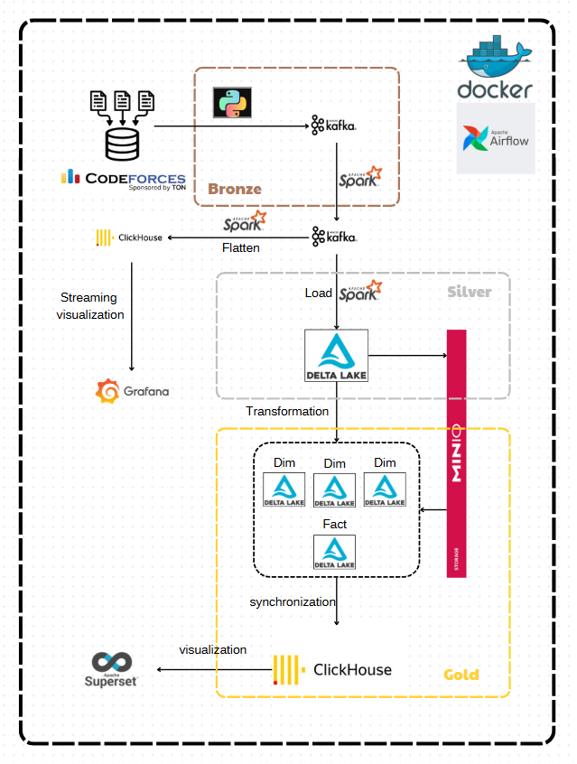

# Codeforces Contest Submission Analysis

This project provides a big data architecture for analyzing Codeforces contest submissions. It leverages a modern data pipeline using Apache Spark, Kafka, ClickHouse, MinIO, Airflow, and Grafana to ingest, process, store, and visualize large-scale contest data.



## Project Structure

- **airflow/**: Orchestration and workflow management (DAGs, configs, requirements).
- **clickhouse/**: ClickHouse database setup and scripts.
- **fake-stream/**: Data generator for simulating contest submissions.
- **grafana/**: Configuration for Grafana dashboards and monitoring.
- **images/**: Architecture diagrams and related images.
- **init/**: Initialization scripts (e.g., MinIO bucket creation).
- **kafka/**, **kafka_script/**: Kafka broker and related scripts for streaming data.
- **minio/**: MinIO object storage configuration.
- **sample/**: Sample data.
- **spark-clean/**, **spark-cleaned/**, **spark-clickhouse/**, **spark-flatten/**, **spark-transform/**: Spark jobs for ETL and data processing.

## Main Components

- **Data Ingestion**: Simulated by [`fake-stream/send_by_time.py`](fake-stream/send_by_time.py), which streams submission data to Kafka.
- **Data Processing**: Apache Spark jobs process and transform the data, storing intermediate results in MinIO and final results in ClickHouse.
- **Orchestration**: Apache Airflow schedules and manages the ETL workflows.
- **Storage**: MinIO for raw/intermediate data, ClickHouse for analytics-ready data.
- **Visualization**: Grafana dashboards connect to ClickHouse for real-time analytics.

## Getting Started

1. **Clone the repository**
   ```sh
   git clone https://github.com/DOCUTEE/CFBIGDATA.git
   cd CFBIGDATA
   ```

2. **Start the stack**
   ```sh
   docker-compose up --build
   ```

3. **Access Services**
   - Airflow: [http://localhost:8080](http://localhost:8080)
   - Grafana: [http://localhost:3000](http://localhost:3000)
   - MinIO: [http://localhost:9000](http://localhost:9000)
   - ClickHouse: [http://localhost:8123](http://localhost:8123)

4. **Simulate Data**
   - Run the data generator in [`fake-stream`](fake-stream) to start streaming submissions.

## Requirements

- Docker & Docker Compose
- Python (for scripts in [`init`](init) and [`fake-stream`](fake-stream))
- See [`airflow/requirements.txt`](airflow/requirements.txt) and [`init/requirements.txt`](init/requirements.txt) for Python dependencies.

## Usage

- Modify or add Spark jobs in the respective `spark-*` directories.
- Update Airflow DAGs in [`airflow/dags`](airflow/dags) to orchestrate new workflows.
- Use Grafana to create or modify dashboards for analytics.

## License

This project is licensed under the Apache License 2.0.

---

For more details, see the architecture diagram above and explore the individual directories for configuration and code.